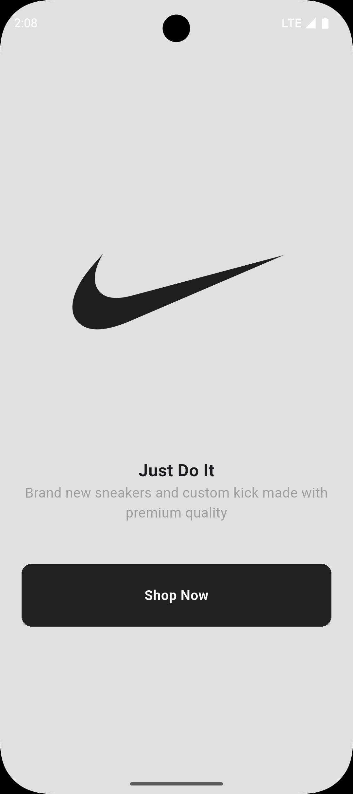
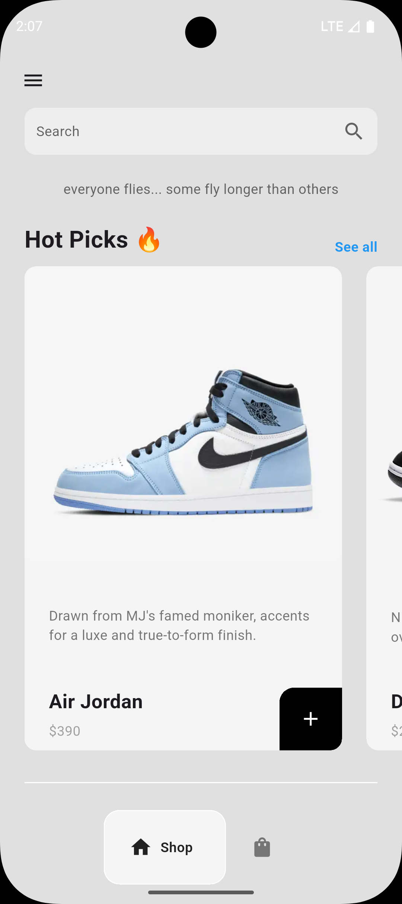
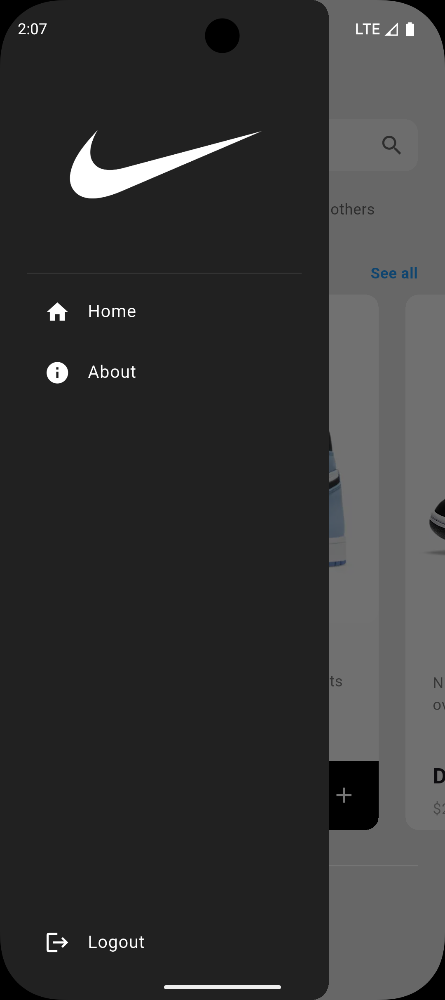
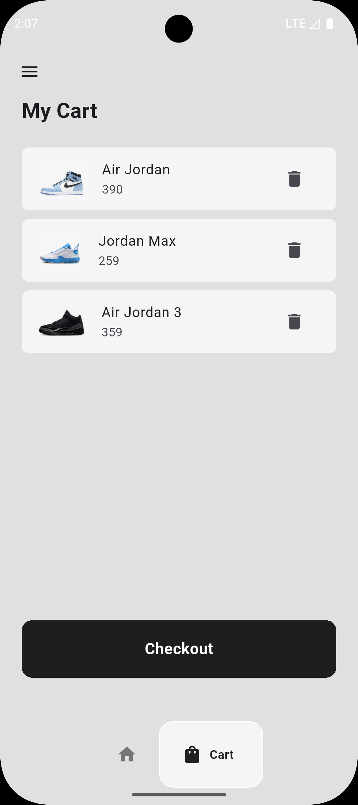
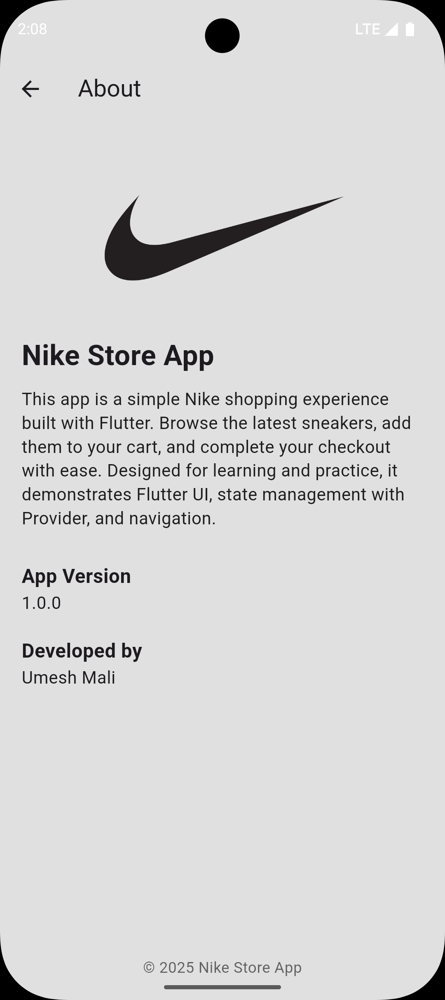

# 👟 Nike Store Flutter App  

A **Nike-inspired eCommerce app** built with **Flutter** 🚀  
Browse sneakers, add them to your cart 🛒, and checkout 💳 with a sleek UI inspired by Nike’s design language.  

---

## ✨ Features  
✅ Modern Nike-inspired UI  
✅ Browse sneakers (Shop Page)  
✅ Add to Cart & Remove from Cart  
✅ Cart Page with quantity & pricing  
✅ Checkout Page with total calculation  
✅ Smooth navigation with Provider state management  
✅ About Page with app details  

---

## 🛠️ Tech Stack  
- **Flutter** 💙 (Cross-platform framework)  
- **Dart** 🐦 (Programming language)  
- **Provider** 🔄 (State Management)  
- **Material Design** 🎨 (UI components)  

---

## 🚀 Getting Started  

### Prerequisites  
- Install [Flutter SDK](https://docs.flutter.dev/get-started/install)  
- Install [Dart](https://dart.dev/get-dart)  
- Set up an emulator or connect a device

---

### Installation  
```bash
# Clone the repository
git clone https://github.com/Umeshhhmali/nike_store_flutter.git  

# Navigate into the project
cd nike_store_flutter  

# Install dependencies
flutter pub get  

# Run the app
flutter run  
```

---

## 📸 Screenshots  
| 👋 Welcome | 🏠 Home | 📂 Drawer | 🛒 Cart | ℹ️ About |  
|------------|--------|-----------|---------|-------------|
|  |  |  |  |  |  

---

###📂 Folder Structure
```
lib/
│── components/    # Reusable UI components (cart item, shoe tile, etc.)
│── models/        # Data models (Shoe, Cart)
│── pages/         # App pages (Home, Cart, Checkout, About)
│── main.dart      # Entry point
```
